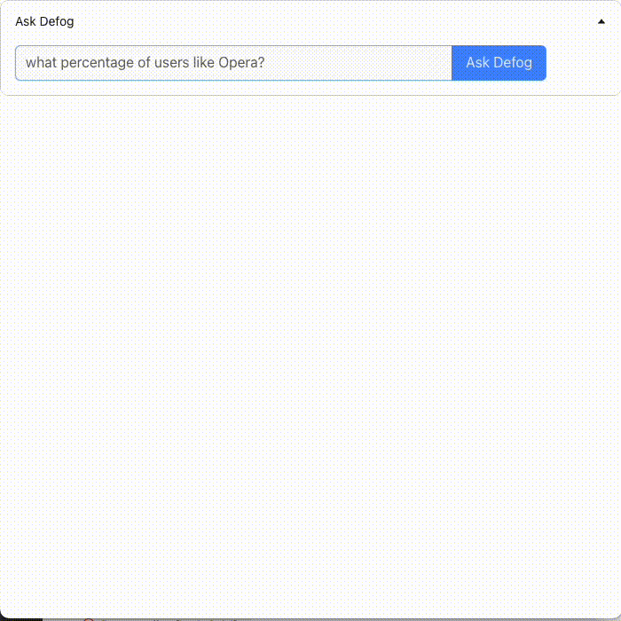

# defog-components

You can install `defog-components` with `npm i defog-components`



You can import our chat-styled component like this. Toggle `debugMode` to `true` and include your apiKey to enable debug mode, where you can look at the actual SQL queries generated to answer your question + give feedback on them.

Debug mode should only be used for local testing, in order to prevent leaking of your API key.

```
import { AskDefogChat } from 'defog-components'

const App = () => {
  return <AskDefogChat
    maxWidth={"100%"}
    maxHeight={"100%"}
    apiEndpoint="YOUR_API_ENDPOINT"
    buttonText={"Ask Defog"}
    // debugMode={true}
    // apiKey={"YOUR_API_KEY"}
  />
}
```
